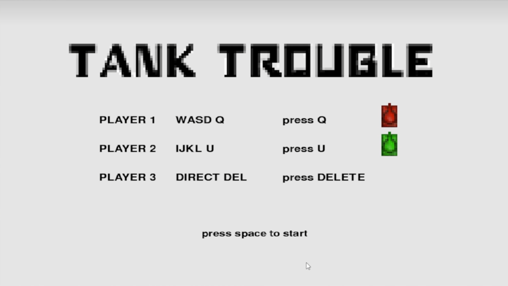

# TANKTROUBLE_python-edition

语言:python 3.10.6

pygame

### 演示图

### 演示视频
https://www.bilibili.com/video/BV13d4y1Y7Tx/?vd_source=6d48c8dce1e2a6f3b5318760f3511c93

使用递归分割算法生成迷宫
基于pygame的AABB碰撞盒实现的精细碰撞逻辑
